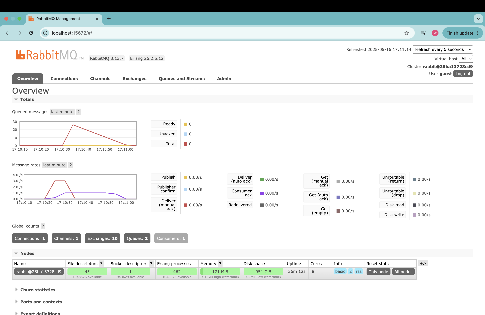
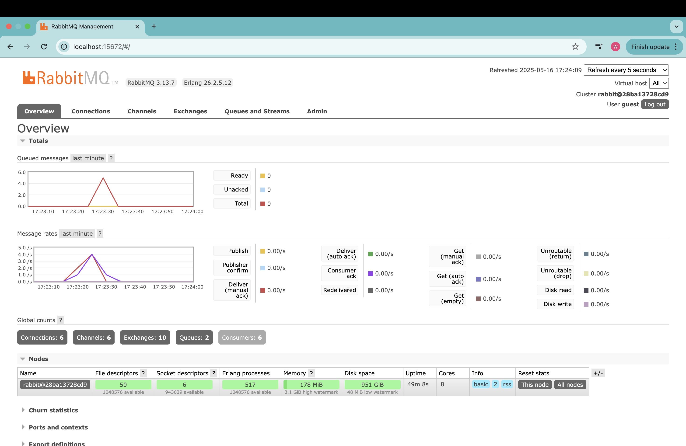

### 1. What is amqp?
> AMQP (Advanced Message Queuing Protocol) adalah protokol komunikasi terbuka yang digunakan untuk mengatur antrian pesan antara sistem secara terstruktur. Protokol ini memungkinkan aplikasi saling bertukar pesan tanpa harus terhubung langsung, biasanya lewat message broker seperti RabbitMQ.

### 2. What does it mean? guest:guest@localhost:5672 , what is the first guest, and what is the second guest, and what is localhost:5672 is for?
> guest:guest@localhost:5672 adalah format URL untuk menghubungkan aplikasi ke RabbitMQ melalui protokol AMQP. Kata guest pertama adalah username default, sedangkan guest kedua adalah password default yang diberikan oleh RabbitMQ. localhost menunjukkan bahwa broker RabbitMQ berjalan di komputer lokal, dan 5672 adalah port standar yang digunakan untuk koneksi AMQP. Format ini dipakai agar aplikasi bisa mengautentikasi dan berkomunikasi dengan broker pesan dengan benar.

### Simulation Slow Subscriber

> Peak queue saya adalah 26, hal ini dikarenakan saya melakukan run pada publisher sebanyak 6 kali, dan setiap publisher dirun ia akan mengirim 5 message pada rabbitmq. Jadi totalnya adalah 30 message yang dikirim secara bersamaan, namun karena mensimulasikan slow subscriber dengan sleep thread, jadi setiap message yang dikirim akan diproses secara lambat oleh subscriber nya, karena itu ada 26 message yang ada di queue yang belum diterima subscriber.

### Simulation using multiple subscriber

> Setelah menggunakan 5 subscriber, saya kembali melakukan 6 kali run pada publisher lagi. Namun, sekarang hasilnya jauh lebih cepat dan peak message yang diqueue hanya 5 (sebelumnya 26). Hal ini dikarenakan setiap subscriber dapat secara paralel menerima dan memproses pesan yang berbeda, sehingga distribusi message menjadi lebih efisien dan queue tidak menumpuk. Improvement yang menurut saya dapat dilakukan adalah pada subscriber untuk mencegah masalah slow subscriber ini. Daripada kita perlu membuka >3 console setiap kali ingin menerima message, kita dapat melakukannya secara otomatis dengan memodifikasi kode subscriber agar berjalan menggunakan multithreading. 